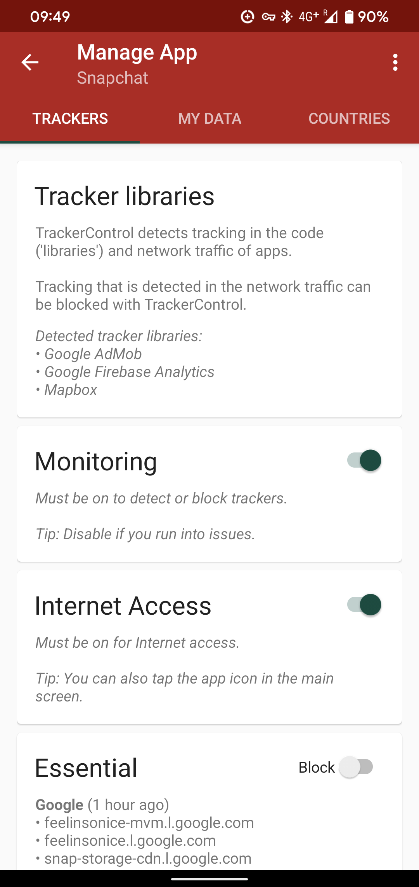

# Summary

Third-party tracking allows companies to collect users' behavioural data, track their activity across digital devices, and potentially share this data with third-party companies. This can put deep insights into private lives into the hands of strangers, and often happens without the awareness of end-users. In light of this, we have developed TrackerControl, which aims to provide the interested individuals with real-time evidence of tracking.

# Statement of need

In the past, the analysis of app tracking often used *off-device network analysis*, e.g. with Charles Proxy or `mitmproxy` [@van_kleek_better_2017; @ren_recon_2016; @kollnig2021_iphone_android]. Such analysis usually comes with the limitation that background system-level communication may be wrongly assigned to an app and taint the analysis results. 

Other past studies have used *static analysis*, trying to gain insights into apps' data practices without executing them [@han_comparing_2013; @pios_2011]. Such static analysis has enabled the analysis of apps in the millions [@playdrone_2014; @wang_2018; @binns_third_2018], but usually does not to generate evidence of actual data transmission to trackers taking place, since apps are never run.

In response, past research has developed on-device network analysis tools [@nomoads_2018; @privacyguard_vpn_2015; @lumen_2018]. Most of these used to operate at a domain-level and provided limited insights into what companies actually receive data from end-users, or to what countries data is sent and for what purpose. Furthermore, none of the previous on-device network analysis tools had been deployed at scale and most remained research prototypes.

# TrackerControl

To improve the quality of tracking analysis and make it available to a wide audience, we developed the Android app TrackerControl (TC). This app provides users with real-time evidence of app tracking. TC analyses the network traffic of other apps, by establishing a local VPN on the Android phone and matching all observed network traffic against a database of known tracking domains. This allows to generate factual evidence of what companies apps share data with, and support research (both academic and non-academic) on app privacy.

The tracking database behind TC is a unique feature of the app. The core of this database is the `X-Ray 2020` database that is the product of significant research efforts over the past years [@van_kleek_better_2017; @binns_third_2018;  @kollnig2021_consent; @kollnig2021_iphone_android]. This database has been created from analysing more than 2 million Android apps. The `X-Ray 2020` is complemented by the Disconnect.me database, that is the foundation for tracker blocking in Mozilla Firefox on the web. We further integrate the commonly used StevenBlack hostlist for tracking in apps, as a fallback. Overall, these databases provide information on 1) the *companies* behind tracking on the web and in apps, 2) the *countries* in which these companies are based, 3) and the *purposes* for which tracking is conducted (e.g. Analytics or Ads).

The core of TC builds on the NetGuard app, which is in active use by millions of users worldwide [@netguard]. The high maturity of NetGuard ensures reliability of tracker analysis whilst minimising battery impact and supporting the long-term maintainability of TC.

In addition to providing insights into app tracking, users of TC can also block unwanted transmissions, which has contributed to building a vibrant community of tens of thousands of users. This community has helped make TC available in 19 languages.

# Screenshots

{ width=25% } { width=25% } { width=25% }

The left-hand screenshot shows the app overview. The middle screenshot shows the observed tracking companies, domains and purposes for one app. The right-hand screenshot shows the destinations of tracking data, obtained from the contacted IP addresses.

# Acknowledgements

Konrad Kollnig was funded by the UK Engineering and Physical Sciences Research Council (EPSRC) under grant number EP/R513295/1.

The underlying network analysis functionality is provided by the NetGuard Firewall, developed by Marcel Bokhorst [@netguard].

TrackerControl would not have been possible without the help of many  outstanding indviduals, including Max Van Kleek, Katherine Fletcher, George  Chalhoub, and numerous app testers and friends.

# References
